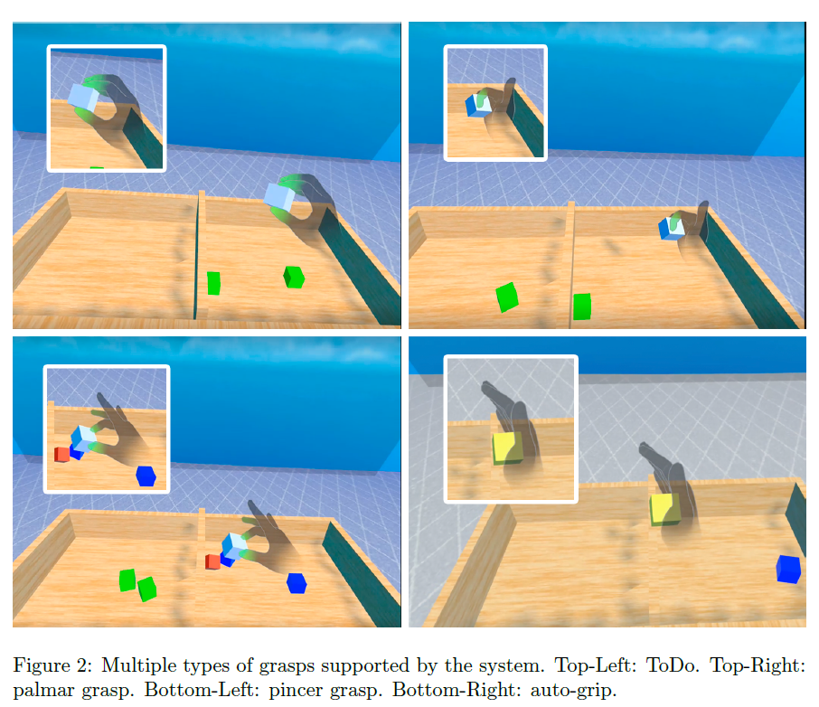
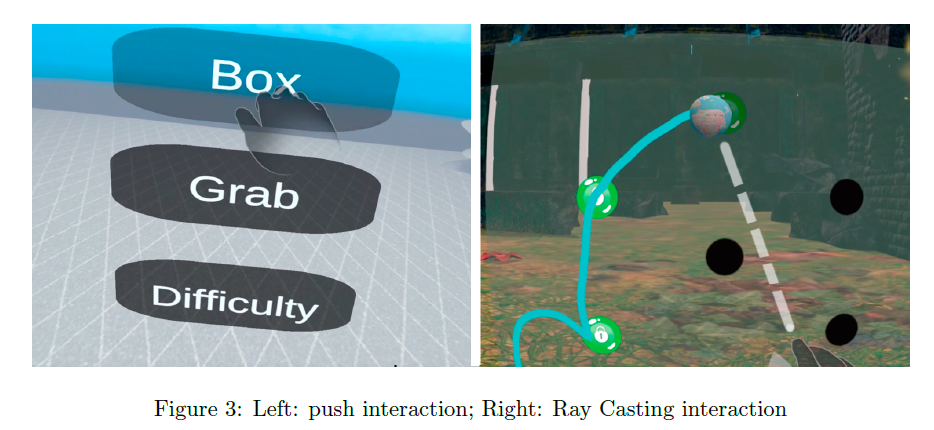
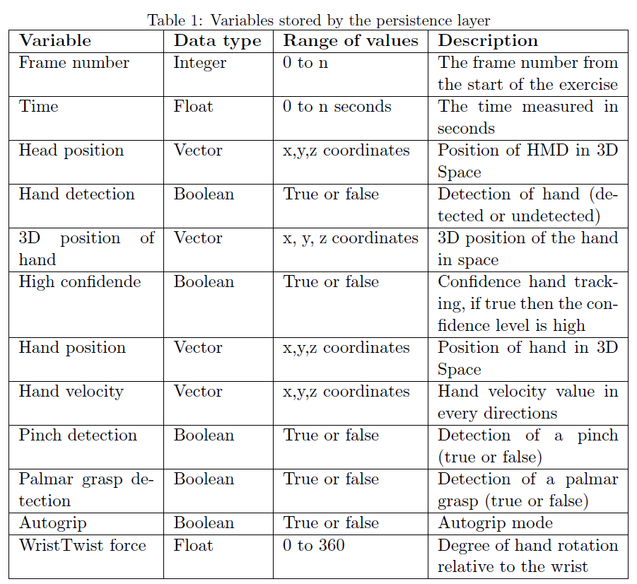

## Description
Next figure illustrates a multilayer architecture in which the upper layer would house new applications for upper limb rehabilitation. These applications, especially developed with Unity 3D and C# for Oculus Quest II, would be supported by the proposed framework, occupying the layers immediately below.
The layered set provides basic functionality to any hand rehabilitation software, and the construction of modular and scalable systems. Our proposal consists of three main layers: i) configuration and calibration, ii) hand interaction and iii) data persistence.

  
First, the configuration and calibration layer plays a crucial role in ensuring that the virtual environment is customized to meet the specific needs of the patient. This layer is responsible for loading and storing the virtual environment preferences for each patient, as well as associating kinematic data from each session with the patient’s identity. By maintaining a historical log of this data, it is possible to track progress and make ongoing adjustments to the virtual environment, such as adjusting the size of objects, the distance between objects and the patient, or calibrating the grip to accommodate any limitations in hand movement. Ultimately, this customization is essential for providing a virtual environment that is tailored to the individual patient’s needs.

Second, the hand interaction layer serves as the core of the system, responsible for modeling and detecting the various types of interactions that the patient can perform with the virtual environment. This layer also provides audiovisual feedback in response to these interactions, enhancing the immersive sensations for the patient. As the central component of the system, the hand interaction layer plays a key role in enabling the patient to interact with the virtual world in a meaningful and engaging way. 

Finally, the persistence layer stores important information about the kinematics of the hand, arm, and head. This layer also maintains a history of executed applications and achievements, which can be used in conjunction with the kinematic data to track the patient’s progress and analyze their evolution. By storing this information and providing a record of the patient’s interactions with the virtual environment, the persistence layer helps to facilitate ongoing evaluation and improvement of the therapy. The following sections describes in greater detail each of these layers that are part of the proposed framework. 

### Configuration and calibration layer

In virtual rehabilitation, it is crucial to consider the unique needs of each patient and make appropriate adaptations to the virtual environment to ensure accessibility. To facilitate this process, a configuration file in this layer is utilized to store information on the user’s preferences. This file is capable of performing read and write operations to allow for customization of various elements within the virtual rehabilitation application. Depending on the VR rehabilitation application, it is possible to configure different elements, such as:
- The hand which receives the UL treatment in function of the dominance (right-or left-handed).
- The location of objects with which the user can interact in the virtual space.
- The level of difficulty of the exercise. The degree of difficulty can be varied through factors such as exercise duration, the number or size of interactive elements, or the method of exercise completion.
- Grip calibration. Additionally, if the virtual rehabilitation application involves grip-based interactions, it may be necessary to conduct calibration to ensure the program is able to accurately detect various grips and pinches. If this is not possible, the exercise can be completed in ”autogrip” mode, whereby objects are automatically grasped andreleased when they reach their designated target position.

### Hand interaction layer
The middle layer of the system comprises three interconnected modules:
a) hand tracking, b) hand interaction control, and c) audiovisual feedback to enhance immersion.

The hand tracking feature is provided by Meta Quest Oculus software development kit (SDK). Our framework supported by this SDK offers three types of hand interaction: grasp, push, and ray casting. Grasp allows the user to pick up, hold, and release objects within the virtual environment. 
Push enables the user to press or activate certain elements in the virtual space, while ray casting allows the user to trace a virtual ray from the center of the hand to a specific object in the scene, that is intended to be interacted with. The system is capable of detecting a wide range of functional grasps, including both power and precision grasps (see netx figure). In addition to these commonly used grips, the system also supports the so-called tenodesis function, which is utilized by patients with spinal cord injuries (SCIs) who have limited finger function. 
One notable feature of these grasping and pinching capabilities is that they have been modified to account for the volume of virtual objects. The degree of grasping or pinching is adjusted to mimic the natural grip on the virtual object, so it is not necessary to physically touch the elements of the hand (e.g. fingers and palm) but rather the volume of the object is taken into consideration. This means that a grasp occurs when the distance between the elements of the hand approximately matches the volume of the virtual object. 

In addition to grasp and pinch interactions, our system also supports a Push interaction that can be used in settings menus to allow users to access options by pushing a button when their hand passes over the surface (see next figure).

This simple interaction allows patients to interact with and operate virtual reality (VR) applications independently, regardless of the severity of their hand impairments. This can be particularly useful in therapy settings, where the patient may be able to operate the VR app without the need for assistance from the therapist. The final interaction mode supported by our framework is ray casting (see previous Figure)which can be used to track the movement of the hand in the virtual space, allowing the user to interact with virtual objects or perform certain tasks. This interaction is often used in rehabilitation exercises that focus on the wrist, arm, and/or forearm. Examples of activities that may utilize ray casting include following a projected path on a surface or completing writing exercises. This interaction mode can be particularly useful for improving fine motor skills and coordination. 

Finally, all these interactions need to be complemented by visual and auditory feedback to achieve a feeling of total immersion. This feedback serves to inform the patient of the current state of the interaction and whether the exercise is being performed correctly. The feedback is associated with three elements: the hand or hands being used for interaction, the interactable elements within the virtual environment, and the success or failure of an exercise. Depending on the type of interaction, the feedback may vary for the first two elements: 
- Grasp: When the fingertips approach an element that can be interacted with, they turn purple. When the object is grabbed, a sound is emitted, and while it is being held, the fingertips turn green and the object becomes gray.
- Push: When an element is pressed, a sound is emitted.
- Ray cast: A line is drawn from the center of the hand to visualize the emitted ray. If the ray passes through the objects in a correct path, the objects will change color.

In addition to the feedback provided for the hand interactions, other audiovisual elements are incorporated into the objects with which the patient interacts. For example, during a grasp interaction, the object may change color when it is being held and return to its original color when it is released. In the case of a ray interaction, the elements that make up the path may also change color as the ray passes through them. Finally, during a push interaction, the object may change its appearance, move inward, or produce a sound effect to indicate the interaction.

### Persistence layer
The persistence layer is essential for the analysis of exercise performance. By storing kinematic data and other relevant information, it enables posterior analysis to determine whether exercises were performed correctly. To reduce file access and improve efficiency, data is processed in batches. Additionally, the high refresh rate means that it is not necessary to save information for every individual frame. The stored data includes the following elements:

Together with these variables, grasp strength is an important factor in many tasks and activities. It is influenced by various factors such as muscle strength, dexterity, and cognitive function. With this framework, we recorded the thumb’s effort relative to the rest of the fingers (pinch) and the effort of each individual finger relative to the palm (palmar grip). Confidence degree data is used for the rejection of false negatives, providing information on the accuracy of hand tracking. Other data, such as the position of the  head is used to detect compensatory movements that may hinder the rehabilitation process. In addition to the real-time kinematic data, the system also stores a history of the applications executed by the patient. This allows for tracking of the patient’s progress and adaptation of the rehabilitation plan accordingly.  
